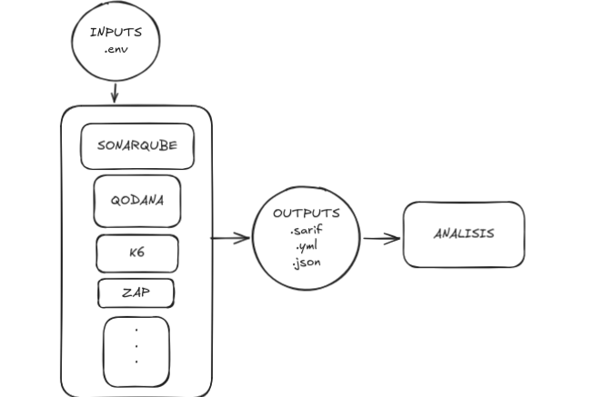

# QA-harness — laboratorio de auditoría/QA multiproyecto

> **¿Vas a auditar un proyecto?** Empieza por `make siguiente TARGET=<proyecto>`: mira el estado
> real y dice el próximo paso. El porqué del método está en [`docs/METODOLOGIA.md`](docs/METODOLOGIA.md) —
> qué aportas tú, qué procesa la herramienta y qué interpretas tú, que son tres partes distintas
> y saltarse la primera o la tercera no da error.

Audita **cualquier** proyecto con herramientas estándar, cada una con su configuración nativa. La
orquestación es `docker compose` declarativo y un `Makefile` de objetivos 1:1.

> **Principio.** El proyecto auditado **nunca se modifica**: se monta *read-only*. Lo único
> escribible es `reports/` y las bases de datos efímeras. El laboratorio **observa**, no corrige.

> **¿Vienes a *usar* la herramienta, no a entenderla?** El paso a paso operativo del analista de QA
> —alta del proyecto, credenciales, matriz de autorización, corrida, veredicto, triaje y entrega—
> está en [`docs/MANUAL_USO_QA.md`](docs/MANUAL_USO_QA.md). Este README explica el diseño y el porqué.

**Requisito único en la máquina destino:** Docker + Docker Compose v2.
**Requisito de capacidad:** sistema de archivos **por debajo del 90% de uso** (SonarQube falla en
silencio por encima) y ~8 GB para imágenes de herramientas. `make doctor` lo comprueba.

---



## Estructura

```
SECURITY-LAB/
  README.md              este documento: el diseño y el porqué. Lo operativo vive en docs/
  docker-compose.yml     núcleo: SÓLO herramientas. Ningún nombre de proyecto aparece aquí.
  Makefile               objetivos; TARGET=<perfil> elige el proyecto
  docs/                  documentación vigente del laboratorio (no de un proyecto):
                         METODOLOGIA (el método) · MANUAL_USO_QA (el paso a paso) ·
                         PUERTOS (registro de convivencia) · PORTABILIDAD (mover el entorno) ·
                         BITACORA_LABORATORIO (defectos del instrumento)
  docs/historial/        informes cerrados sobre el propio laboratorio: se leen, no se editan
  lib/dimensions.yml     EL REGISTRO: qué dimensiones existen, qué artefacto deja cada una,
                         qué umbral la juzga, qué cuesta y dónde puede ejecutarse. Lo leen el
                         gate, el manifiesto, el informe, las dos pantallas de la UI y esta
                         misma documentación — una sola lista, no siete copias.
  tools/                 new · detect · doctor · tier · require-live · secrets · gate ·
                         run-manifest · status · dashboard · triage · doc-check ·
                         run-dimension (única indirección de ejecución) · conversores a SARIF
  ui/                    la interfaz web local (make ui) — FastAPI, un solo operador
  recipes/               bloques de arranque reutilizables (postgres, moodle-plugin,
                         moodle-baseline, fastapi-uvicorn, kafka-zk)
  lib/auth/              adaptadores de autenticación (sanctum, moodle-session, jwt-bearer,
                         basic, zajuna, none)
  lib/specs/             pruebas genéricas que hereda todo proyecto (cabeceras, matriz de autorización,
                         presupuesto del hilo principal)
  lib/semgrep/           reglas SAST propias del laboratorio, por pila (laravel-vue.yml)
  lib/k6/                sesión compartida (session.js) y forma de la carga, cuentas por usuario
                         virtual y detalle por endpoint (carga.js)
  lib/aaa/presets/       eventos de auditoría por stack (moodle: mdl_logstore_standard_log)
  configs/               la llave de despliegue de `make clone` (deploy_key, no versionada)
  baselines/             instantáneas «antes de»: de plataforma (moodle-*: código + dump, solo el
                         MANIFEST se versiona), del core (core-*) y de perfiles (perfil-*). Las
                         dos últimas llevan datos y credenciales reales: nunca se versionan
  targets/<nombre>/      el perfil de un proyecto: target.env, target.env.local, compose.runtime.yml,
                         zap/, k6/, playwright/, jmeter/, db-init/, amenazas/ (modelo STRIDE),
                         aaa/ (sondas de autenticación y eventos de auditoría), hallazgos/,
                         riesgos/, CONTEXTO.md
  work/<nombre>/         clones hechos por `make clone`                        [no versionado]
  reports/<nombre>/      salidas + RUN.md (qué se ejecutó y qué NO)            [no versionado]
  reports/_entregas/     paquetes ya entregados (zip de informes y evidencias) [no versionado]
```

La línea de corte: el núcleo hace lo que se puede saber **leyendo un repositorio**; el perfil aporta
lo que sólo se sabe **conociendo la aplicación** (cómo arranca, cómo se inicia sesión, qué endpoints
existen, qué rol puede alcanzar qué).

### Dónde va cada cosa

Cuatro preguntas deciden el sitio de un archivo, en este orden:

1. **¿Lo ejecuta el laboratorio?** Núcleo: `Makefile`, `docker-compose.yml`, `tools/`, `ui/`,
   `lib/`, `recipes/`. Se versiona siempre.
2. **¿Describe el laboratorio o el método?** `docs/` si sigue vigente; `docs/historial/` si es un
   informe cerrado. En la raíz solo queda `README.md`.
3. **¿Es de UN proyecto?** `targets/<perfil>/`: contrato, guiones, hallazgos, riesgos, contexto.
   Lo que el proyecto necesita en local pero no puede publicarse va en `target.env.local`.
4. **¿Es dato, no código?** No se versiona: `reports/` (lo que escriben las herramientas),
   `work/` (clones), `baselines/` (instantáneas «antes de» de plataforma, core o perfil).

Dos reglas transversales:

- **Cuatro niveles de carpetas como máximo** bajo la raíz (`targets/antiplagio/corpus/EV-A/` es el
  cuarto). Si algo pide un quinto, se aplana. Las únicas excepciones son el árbol que una
  herramienta escribe dentro de `reports/<perfil>/<herramienta>/` (el visor HTML de Qodana o de
  JMeter trae el suyo) y el interior de un clon en `work/`.
- **Una copia de seguridad no se hace al lado del original.** Va a
  `baselines/perfil-<perfil>-precambios-<fecha>/` y `.gitignore` la excluye por nombre: un
  `movil.bak-*` junto a `movil/` hereda las credenciales, pero no la regla que las protege.

---

## Qué tienes que traer (la escalera)

**El laboratorio no instala tu aplicación.** Hay tres peldaños y cada uno desbloquea más:

| Peldaño | Qué aportas | Qué se desbloquea |
|---|---|---|
| **1** | un checkout del código | secretos · CVE · configuración · SAST · SBOM · calidad |
| **2** | + **tu** despliegue (URL + 2 cuentas) | + DAST · autorización · flujos · carga |
| **3** | + una receta de arranque | lo mismo, pero efímero y reproducible |

El peldaño 1 no necesita desplegar nada: con la ruta al código ya produce hallazgos. El **2 es el
caso normal**: tu aplicación corre donde sea que la despliegues y el laboratorio le apunta — no la
levanta ni la administra, y no hace falta escribir ningún `compose.runtime.yml`. El 3 solo se usa
cuando quieres repetibilidad exacta o no depender de que alguien mantenga un despliegue vivo.

`make doctor TARGET=<perfil>` te dice en qué peldaño estás y qué queda bloqueado.

Los objetivos están etiquetados según lo que necesitan, y `make help` los agrupa:

- **`[code]`** — solo el checkout.
- **`[live]`** — la aplicación respondiendo. Abortan con una explicación si no lo está: un reporte
  de ZAP limpio contra una aplicación caída es idéntico a uno contra una aplicación segura.
- **`[admin]`** — mantenimiento.

## Interfaz web

```bash
make ui        # http://127.0.0.1:7777
```

Alta de proyectos, ejecución con log en vivo, configuración por formulario y captura de triaje.

> **Solo para el operador, en `127.0.0.1`.** Tiene el socket de Docker: quien alcance ese puerto
> ejecuta contenedores arbitrarios, es decir, root en este equipo. `make ui` verifica el
> confinamiento al arrancar y **apaga la interfaz** si alguna vez queda publicada más allá de
> loopback. Compartirla por red exigiría autenticación, permisos por rol, auditoría y custodia de
> credenciales — deliberadamente no construidos.

Si tu código vive fuera del directorio padre del laboratorio, indícalo:
`make ui SRC_MOUNT=/home/dev/repos`.

## Dar de alta un proyecto

```bash
make new    TARGET=proyecto_x            # esqueleto desde targets/_template
$EDITOR targets/proyecto_x/target.env    # SRC_PATH (o REPO_URL+BRANCH)
make detect TARGET=proyecto_x            # propone LANGS, AUTH_ADAPTER y recetas
make doctor TARGET=proyecto_x            # preflight: docker, disco, puertos, permisos, roles
make static TARGET=proyecto_x            # YA produce hallazgos, sin levantar nada
```

Para las dimensiones dinámicas (peldaño 2) hay que aportar además:

- `BASE_URL` y `HEALTH_PATH`: dónde responde **tu** despliegue y cómo saber que está vivo. Si
  corre en este mismo equipo, `APP_INTERNAL_URL=http://host.docker.internal:<puerto>` — dentro de
  la red del compose, «localhost» es el contenedor de la herramienta, no tu máquina.
- `AUTH_ADAPTER` y **dos cuentas de distinto privilegio** (`ROLE_A_*`, `ROLE_B_*`).
- `playwright/authz-matrix.json`: qué rol puede alcanzar qué. **Ninguna herramienta lo sabe.**
- Un escenario sembrado (los datos sobre los que la operación autorizada sí funciona).

### Dónde van las credenciales: `target.env` vs `target.env.local`

`target.env` **se versiona**: es el contrato del perfil — qué variables existen y qué significa cada
una. `target.env.local`, a su lado, **nunca** entra en git (`.gitignore`) y es el único sitio donde
van los valores que no pueden salir del equipo: la URL del despliegue interno y las contraseñas.

```bash
cp targets/proyecto_x/target.env.local.example targets/proyecto_x/target.env.local
$EDITOR targets/proyecto_x/target.env.local     # aquí sí, valores reales
```

El `.local` se carga **encima** del contrato y gana clave a clave: el `Makefile` pasa los dos
`--env-file` a compose, cada servicio lo declara como `env_file` opcional, y `tools/lib-env.sh` lo
consulta primero. Una clave vacía en el `.local` **no** anula: `BASE_URL=` en el contrato significa
«este perfil aún no apunta a ningún despliegue», y un `.local` a medio rellenar no debe convertir
eso en otra cosa. Para tapar una clave se le da valor; para heredarla, se omite.

Un perfil no nace con credenciales reales — se vuelve peligroso el día que deja de apuntar a
`localhost` con cuentas sembradas y se le apunta a un despliegue de validación. Ese es el momento
de mover los valores al `.local`; **publicar una credencial en un remoto alojado la escribe en el
historial para siempre.** Sin el `.local`, el perfil sigue siendo válido: las dimensiones `[code]`
corren igual y las `[live]` se detienen en `require-live` en vez de fingir que pasaron.

Solo si quieres el peldaño 3 escribes `compose.runtime.yml`, componiendo `recipes/` con `include:`
(rutas relativas al **directorio del proyecto**).

```bash
make up TARGET=proyecto_x                # solo en el peldaño 3
make e2e dast perf TARGET=proyecto_x
make run-manifest TARGET=proyecto_x      # reports/proyecto_x/RUN.md: cobertura real
make gate         TARGET=proyecto_x      # veredicto: sale != 0 si se incumplen umbrales
make dashboard    TARGET=proyecto_x      # reports/proyecto_x/index.html: todo en una página
make down         TARGET=proyecto_x      # sin residuos
```

## Leer los resultados

```bash
make dashboard TARGET=proyecto_x && xdg-open reports/proyecto_x/index.html
```

Cada herramienta escribe en su propio dialecto: cinco SARIF que no se ponen de acuerdo en dónde
va la severidad, más JSON de Playwright y de k6. `make dashboard` los consolida en un HTML
autocontenido — sin servidor, sin dependencias, sin red — con el veredicto de la compuerta, la
cobertura real y la evidencia `archivo:línea`.

Tres decisiones deliberadas de esa página:

- **No recalcula el veredicto**: invoca `tools/gate.sh` y muestra su salida, de modo que el
  dashboard y el pipeline no puedan discrepar sobre si la corrida pasó.
- **Una dimensión sin ejecutar se pinta `NO EJECUTADO`, jamás como cero hallazgos.** Un gráfico
  tranquilizador sobre un análisis que nadie corrió es peor que no tener gráfico.
- **Es un archivo**, no un servicio. Se abre con doble clic y se adjunta a un correo. Un tablero
  de seguridad que necesita un servidor para leerse es un servidor que alguien acabará exponiendo.

`make help` lista todos los objetivos. `make list` los perfiles existentes.

---

## Dimensiones y herramientas

<!-- dimensiones:inicio -->
| Dimensión | Herramienta | Comando | Artefacto | Runtime |
|---|---|---|---|---|
| Contrato de despliegue | ingest-deploy | `make ingest-deploy` | `deploy-contract.sarif` | no |
| Secretos en la historia git | gitleaks | `make secrets` | `gitleaks.sarif` | no |
| Secretos verificados en vivo | TruffleHog | `make secrets` | `trufflehog.sarif` | no |
| Dependencias / CVE | Trivy fs | `make deps` | `trivy/trivy-fs.sarif` | no |
| Configuración de contenedores | Trivy config | `make config-scan` | `trivy/trivy-config.sarif` | no |
| CVE de imágenes | Trivy image | `make image-scan` | `trivy/trivy-image.sarif` | no |
| Inventario de componentes (SBOM) | Syft | `make sbom` | `sbom/sbom.spdx.json` | no |
| SAST | semgrep | `make semgrep` | `semgrep/semgrep.sarif` | no |
| Calidad (SonarQube) | SonarQube | `make sonar` | `sonar/sonar.sarif` | no |
| Calidad (Qodana) | Qodana | `make qodana` | `qodana/qodana.sarif` | no |
| Artefacto móvil (APK/IPA) | MobSF | `make mobile-scan` | `mobile/mobsf.sarif` | no |
| Contrato de API (Spectral) | Spectral | `make api-lint` | `api/spectral.sarif` | no |
| Contrato vs implementación (Schemathesis) | Schemathesis | `make api-fuzz` | `api/schemathesis.xml` | **sí** |
| Modelo de amenazas (STRIDE) | Threagile | `make amenazas` | `amenazas/threagile.sarif` · `amenazas/data-flow-diagram.png` | no |
| Superficie runtime (DAST) | OWASP ZAP | `make dast` | `zap/zap.sarif` · `zap/zap-report.html` | **sí** |
| Autorización y flujos (E2E) | Playwright | `make e2e` | `playwright/results.json` | **sí** |
| AAA · autenticación | Playwright | `make aaa` | `aaa/authn.sarif` · `aaa/AAA.md` | **sí** |
| AAA · autorización (matriz) | Playwright | `make aaa` | `aaa/authz.sarif` · `aaa/AAA.md` | **sí** |
| AAA · auditoría (oráculo) | psql | `make aaa` | `aaa/acct.sarif` · `aaa/AAA.md` | **sí** |
| Carga (k6) | k6 | `make perf` | `k6/summary.json` | **sí** |
| Carga (JMeter) | JMeter | `make perf-jmeter` | `jmeter/results.jtl` | **sí** |
| Flujos de usuario en navegador (MCP) | Playwright MCP | `make mcp-journey` | `mcp/journeys.md` | **sí** |
| Jornadas en dispositivo real (adb) | adb | `make device-e2e` | `device/jornadas.md` | **sí** |
<!-- dimensiones:fin -->

`make static` = `secrets deps config-scan sbom semgrep qodana sonar`, y `make live` = `dast perf
e2e`: los dos agregados cubren lo habitual, no *todo* lo etiquetado. Las dimensiones que dependen
de un artefacto del perfil —`api-lint`, `api-fuzz`, `build`, `perf-jmeter`, `budget`, `image-scan`,
`amenazas`, `aaa`— se invocan aparte, a propósito: incluirlas en el agregado haría que un perfil sin
plan `.jmx` o sin OpenAPI arrastrara un `NO DISPONIBLE` en cada corrida. `make all` = `static live`.
`make aaa` (autenticación · autorización · auditoría) sustituye a `make e2e` cuando el perfil trae
guiones AAA: es la misma suite más el oráculo de auditoría y un SARIF por pilar.

### Reglas SAST propias (`lib/semgrep/`)

Los paquetes públicos de semgrep buscan vulnerabilidades **clásicas** — inyección, XSS, criptografía.
No conocen los modos de fallo del **framework**, que rompen un despliegue en producción sin ser
vulnerabilidades y por eso ninguna herramienta del laboratorio los veía. `lib/semgrep/laravel-vue.yml`
codifica dos defectos reales encontrados a mano (`env()` fuera de `config/`, que devuelve `null` en
cuanto corre `php artisan config:cache` — es decir, solo en producción; y las rutas absolutas a
`assets` que sobreviven al `build` de Vite). Un perfil las activa añadiendo
`--config=/seclab-lib/semgrep/laravel-vue.yml` a su `SEMGREP_CONFIG`.

### Calidad: dos motores, un presupuesto (`make sonar` · `make qodana`)

SonarQube y Qodana hacen la misma pregunta —defectos en el código que escribió este equipo— con
motores distintos, así que sus hallazgos **se suman** contra un solo `MAX_QUALITY_FINDINGS`. Dos
presupuestos separados dejarían pasar un proyecto repartiendo sus hallazgos entre ambos. El gate
imprime el desglose (`[sonar=500 qodana=134]`) para que un número alto se pueda atribuir.

Ninguno de los dos exige que el perfil sepa nada de la herramienta:

- **Sonar** acuña su propio token contra un servidor recién arrancado (`tools/sonar-token.sh`) y,
  como es la única herramienta del laboratorio que necesita un servidor, libera el puerto cuando
  lo ocupa el SonarQube de otro perfil (`tools/sonar-free-port.sh`) en vez de morir con un
  «port is already allocated» que no nombra al culpable.
- **Qodana** resuelve su linter desde `LANGS` (`tools/qodana-image.sh`). Esto era un hueco real y
  medido: `QODANA_IMAGE` nacía vacío, vacío significaba «salto declarado», y los cuatro perfiles
  versionados lo tenían vacío — la dimensión **no había corrido jamás en ningún proyecto**.

El límite de Qodana es de licencia, no del laboratorio: JetBrains solo publica imágenes
`-community` (sin token) para python, jvm y android. Para PHP, JS, Go o .NET el único linter es de
pago y exige `QODANA_TOKEN`. Sin él la dimensión se reporta **`NO DISPONIBLE`, con la razón** —
nunca como aprobada— y la calidad de ese proyecto la cubren SonarQube y semgrep, que sí son
agnósticos.

### Carga y capacidad (`make perf-escalera` · `make capacidad`)

`make perf` es una corrida y un veredicto. La capacidad —cuánta gente, qué se satura primero,
cuánto recurso por usuario— sale de una **escalera** con telemetría:

```bash
make perf-escalera TARGET=<proyecto>    # sube por pasos (carga/escalera.env), para en el primero que incumple
make capacidad     TARGET=<proyecto>    # reports/<proyecto>/k6/CAPACIDAD.md
```

Cada paso es la dimensión `k6` de siempre, con `tools/perf-telemetria.sh` muestreando el sistema
bajo prueba (contenedores por cgroup, procesos del host, conexiones de PostgreSQL) sin pedirle
credenciales. `tools/perf-capacidad.py` lee la escalera y marca cada cifra como medida,
extrapolada o supuesta. El método y sus trampas: `docs/METODOLOGIA.md` §4.quinquies; lo que
aporta el perfil: `docs/MANUAL_USO_QA.md` §4.10.

El generador está fijado (`K6_IMAGE`, `grafana/k6:2.2.0`): dos cifras solo son comparables si
las produjo la misma versión.

### Presupuesto del hilo principal (`make budget`)

La dimensión que faltaba: **el navegador**. k6 mide el servidor, ZAP mide cabeceras, la matriz mide
permisos — y con los tres en verde la pestaña del usuario puede seguir congelándose, porque el
trabajo caro ocurre en su equipo, no en el tuyo. Esta prueba rastrea el bundle **entero** (no solo la
pantalla actual), cuenta **megapíxeles descodificados** en vez de bytes —que es lo que predice el
bloqueo, y lo que delata una «optimización» que recomprime sin redimensionar— y mide con la **CPU
frenada** ×4, que convierte «a mí me funciona» en un número. Umbrales y validación de la propia
herramienta: [`lib/specs/README-main-thread-budget.md`](lib/specs/README-main-thread-budget.md).

### Si la aplicación limita peticiones, decláralo (`E2E_PACE_MS`)

Una suite que inicia sesión en cada prueba se atropella a sí misma contra cualquier backend con
limitador: pasado el umbral el login devuelve `429`, la comprobación lo lee como «acceso denegado» y
el laboratorio reporta un falso positivo masivo **sobre la dimensión que existe para medir**. En
Costos Web fueron 59 fallos de autorización inexistentes. Tres medidas, ya en el núcleo:

- La sesión de cada rol se abre **una vez** y se reutiliza (`lib/auth`, memorizada por adaptador+rol).
- `workers: 1` en el perfil, porque cada worker es un proceso con su propia caché — N workers son N
  inicios de sesión por rol. Y `retries: 0`: un fallo intermitente de autorización es un hallazgo,
  no ruido que reintentar hasta que salga verde.
- `E2E_PACE_MS` en `target.env` espacia las comprobaciones de la matriz. Por defecto no hay espera;
  se declara solo en los perfiles cuya aplicación lo necesita.

**Y en la matriz, cuidado con las escrituras.** El motor ejecuta cada regla con **todos** los roles,
incluido el permitido — un endpoint que deniega a quien tiene derecho también es un hallazgo. Con un
`PUT` eso no es una comprobación: es la mutación real. Una regla `PUT {rol_id:1}` ascendió a la
cuenta de menor privilegio a administradora, y con ese privilegio otra spec borró la cuenta
administradora del entorno. Regla: en `authz-matrix.json`, escrituras **solo** contra objetivos
desechables o inexistentes; las que tocan datos del proyecto van en una spec del perfil, que puede
restaurar lo que toca.

---

## Lo que el laboratorio NO hace

Está escrito aquí porque es el modo de fallo más probable de esta herramienta: leerla como un botón.

- **No instala tu aplicación.** Ver la escalera arriba: con el código solo ya analiza; para medir
  en vivo le apuntas a tu despliegue.
- **No conoce la política de autorización.** Un `200` sólo es hallazgo si la política decía `403`.
  Esa política la escribe una persona en `authz-matrix.json`.
- **No tría.** Un hallazgo de dependencia no es un riesgo hasta que alguien evalúa alcanzabilidad.
- **No inventa escenarios de abuso de negocio.** Esos guiones se escriben después de leer el código.
- **No calibra severidad** en contexto institucional.
- **No distingue un fallo del proyecto de uno del entorno.** Si SonarQube no corrió por falta de
  disco, eso no dice nada sobre el proyecto.
- **`skip` no es `PASS`.** `make gate` lo imprime y `RUN.md` lo registra. Una dimensión que no se
  ejecutó nunca debe leerse como aprobada. Y **`NO DISPONIBLE` no es `NO EJECUTADO`**: lo primero
  es que este perfil aún no puede medirlo; lo segundo, que podía y no se hizo.
- **No tría por ti, pero sí guarda tu triaje.** En la interfaz marcas cada hallazgo como
  confirmado / falso positivo / inconcluso con su razón, y eso viaja al informe. Sin ese paso, el
  razonamiento se pierde en cuanto cierras la sesión.

Detalle completo, con la evidencia de la corrida que lo demostró, en
[`docs/historial/INFORME_MIGRACION_SECURITY_LAB.md`](docs/historial/INFORME_MIGRACION_SECURITY_LAB.md).

---

## Dos remotos, un `git push`

Este laboratorio vive en dos sitios y **todo cambio debe llegar a los dos**:

| Remoto | Para qué |
|---|---|
| `ssh://git@git.fsrisaralda.com:2222/fabrica_zajuna_otros/calidad_seguridad.git` | institucional; `main` está protegida, se entra por MR desde `dev` |
| `https://github.com/Zlioz8/QA-harness.git` | espejo **público** |

`origin` está configurado con dos URLs de push, así que un solo `git push` los actualiza ambos:

```bash
git push origin dev          # va a GitLab y a GitHub
git remote -v                # 'origin' aparece con dos líneas (push)
```

Si clonas de nuevo, se reconstruye con:

```bash
git remote set-url --add --push origin https://github.com/Zlioz8/QA-harness.git
git remote set-url --add --push origin ssh://git@git.fsrisaralda.com:2222/fabrica_zajuna_otros/calidad_seguridad.git
```

GitHub va por **HTTPS** y GitLab por SSH. No es un descuido: el push a GitHub se autentica con el
credential helper (`gh auth git-credential`), que sí sabe qué cuenta eres. Por SSH dependerías de
qué llave ofrezca el agente — y ese camino ya falló una vez, autenticando contra la cuenta
equivocada. Si prefieres SSH para GitHub, registra la pública del equipo en tu cuenta y declara la
identidad explícitamente en `~/.ssh/config` (`Host github.com` + `IdentityFile` + `IdentitiesOnly
yes`); no lo dejes a la llave por defecto.

> **Uno de los dos espejos es público.** Antes de commitear, esa es la audiencia real de cualquier
> dirección de infraestructura, credencial o volcado que entre al árbol — ver Política de datos.
> Publicarlo lo escribe en un historial que no controlas.

## Política de datos

El laboratorio puede llegar a concentrar datos personales reales, credenciales de prueba conocidas y
servicios sin endurecer: es un activo sensible, no una carpeta de trabajo.

- Todos los puertos publicados se atan a `127.0.0.1`. Es un invariante del núcleo — no lo cambies.
- Preferir semillas **sintéticas**. Un volcado de producción sólo se justifica para reproducir un
  comportamiento dependiente del volumen, y con fecha de caducidad.
- **Ninguna credencial real, ni ninguna dirección de infraestructura interna, en un archivo
  versionado.** Van en `targets/<perfil>/target.env.local` (ver arriba). Tampoco incrustadas como
  valor por defecto en una spec: un `process.env.BASE_URL || 'https://10.0.0.5'` sobrevive al
  despliegue que lo motivó y acaba midiendo el servidor equivocado, en verde. Sin objetivo, fallar.
- Cuando un perfil no puede tener cuentas sintéticas en absoluto, se excluye entero del repositorio
  (`targets/movil/`). El `.local` es la alternativa que conserva el contrato versionado.
- `make purge TARGET=<perfil>` borra los reportes de un perfil. Anonimiza antes de compartirlos.
- `make down TARGET=<perfil>` destruye contenedores y volúmenes.

## Perfiles actuales

| Perfil | Stack | Estado |
|---|---|---|
| `costos_web` | Laravel + Vue + PostgreSQL | peldaño 2 contra el despliegue de validación: matriz de 6 roles, flujos de negocio, recorrido de pantallas por rol y presupuesto del hilo principal. Credenciales en `target.env.local` |
| `antiplagio` | Moodle + plugin PHP + FastAPI + Kafka + analyzers | estático y dinámico ejecutados; ver `reports/antiplagio/RUN.md` |
| `anuncios_de_plataforma` | Plugin Moodle sobre la línea base de plataforma (`baselines/`) | peldaño 3: el laboratorio levanta el Moodle real; estático + ZAP + k6 + JMeter ejecutados |
| `_template` | — | esqueleto para el siguiente proyecto |

`targets/movil/` existe en esta máquina y **no está en el repositorio**: sus cuentas son reales, no
sembradas (ver Política de datos). Que no aparezca en `make list` de un clon nuevo es lo correcto.
